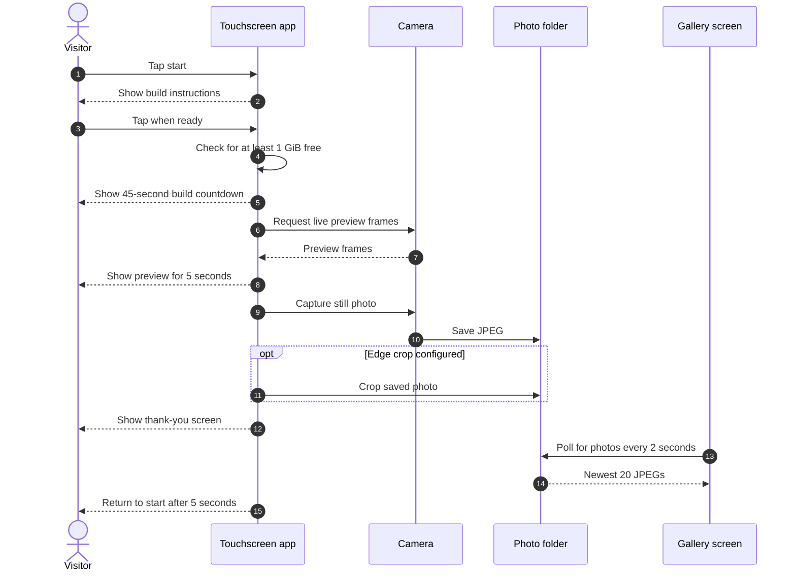

# Duckbooth

A touchscreen photo booth for a Raspberry Pi with a Camera Module 3 Wide. One screen walks visitors through building a LEGO duck and taking its photo. A second screen shows the 20 most recent photos.

This setup assumes a Raspberry Pi OS desktop session running labwc, a user named `booth`, and these display connections:

- `HDMI-A-2`: touchscreen and booth controls
- `HDMI-A-1`: photo gallery

The paths and display names are currently set in the files, rather than read from a config file. If your Pi uses different ones, edit them before installing.

## Install on the Pi

Use Raspberry Pi OS packages for Picamera2, PyQt5 and Pillow. The app runs with `/usr/bin/python3`, so packages installed into a separate virtual environment will not be visible to it.

```sh
sudo apt update
sudo apt install python3-picamera2 python3-pyqt5 python3-pil
```

From the repository root, copy the app files to `/home/booth/duckbooth`. The code expects `main.py` directly in that directory.

```sh
mkdir -p /home/booth/duckbooth
cp main.py start-duckbooth.sh duckbooth.service duckbooth.desktop duckbooth-start.desktop labwc-rc.xml /home/booth/duckbooth/
chmod +x /home/booth/duckbooth/start-duckbooth.sh
mkdir -p /home/booth/photobooth/photos
mkdir -p ~/.config/systemd/user ~/.config/autostart ~/Desktop
cp /home/booth/duckbooth/duckbooth.service ~/.config/systemd/user/
cp /home/booth/duckbooth/duckbooth.desktop ~/.config/autostart/
cp /home/booth/duckbooth/duckbooth-start.desktop ~/Desktop/
systemctl --user daemon-reload
```

Run these commands as `booth` from the graphical desktop session. The autostart entry waits 12 seconds for labwc to come up, then starts the user service. Log out and back in, or start it now with `systemctl --user start duckbooth.service`.

`labwc-rc.xml` contains the touch mapping for the ILITEK touchscreen and a rule that moves the gallery to `HDMI-A-1`. Merge those entries into `~/.config/labwc/rc.xml`. If you have no existing labwc configuration to keep, you can use this file as `rc.xml` instead. Check the touchscreen device name and output names on your Pi; they must match the hardware. Restart the desktop session after changing labwc's configuration.

## Using the booth



Tap the first screen, build your duck, then tap again. The booth gives you 45 seconds to build, followed by a five-second camera preview to position the duck. It takes one photo, shows a thank-you screen for five seconds, and returns to the start. The gallery updates every two seconds and shows the newest 20 JPEGs. If the gallery monitor is disconnected, the booth continues on the touchscreen.

The gear button on the start screen opens camera settings. Zoom runs from 1.0× to 3.0× in 0.1× steps. You can also trim each edge of the saved photo in 5% steps, up to 35% per edge. The preview shades the parts that will be cut off. Changes are saved immediately to `/home/booth/duckbooth/settings.json`; **Herstel alles** resets them and **Klaar** returns to the start screen.

Photos are saved as JPEGs in `/home/booth/photobooth/photos`. The booth requires at least 1 GiB of free space before starting a capture. It does not delete old photos.

## Stopping and checking the app

Press `Ctrl`+`Alt`+`Q` in the booth window to close it. Use the **Start Duckbooth** desktop shortcut to open it again. You can also use the service directly:

```sh
systemctl --user start duckbooth.service
systemctl --user stop duckbooth.service
systemctl --user status duckbooth.service
journalctl --user -u duckbooth.service -b
```

Application errors are written to `/home/booth/duckbooth/duckbooth.log`. If the camera does not start, check that the Camera Module 3 Wide is connected and that the Pi can use it outside Duckbooth. If touch or the gallery appears on the wrong screen, check the output names and the labwc touch/window rules. If the booth reports low space, free space on the filesystem containing `/home/booth/photobooth/photos` before trying again.
